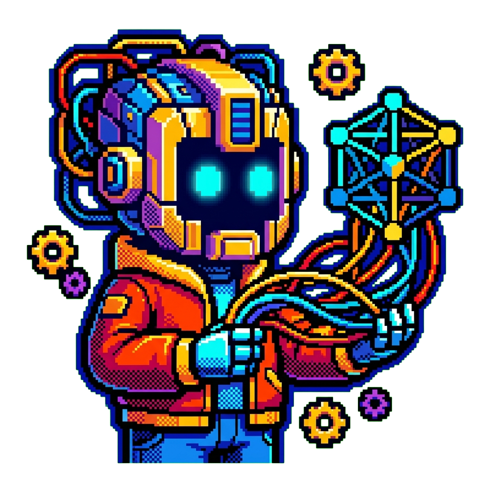

<div align="center">
  

  [](https://www.python.org/)
  [](https://huggingface.co/docs/transformers)
  [](LICENSE)

  **🤗 A quick start sandbox for exploring Hugging Face Transformers pipelines with PyTorch**

</div>

## 🚀 Quick Start

```bash
git clone https://github.com/tsilva/sandbox-transformers.git
cd sandbox-transformers
uv sync
uv run python main.py
```

## ✨ What It Does

Runs a simple Transformers pipeline demo in `main.py`:

- **Sentiment analysis** — classifies text as positive/negative
- **Text generation** — generates text continuations with GPT-2

```python
from transformers import pipeline

classifier = pipeline("sentiment-analysis")
classifier(["I love this!", "This is terrible."])
# [{'label': 'POSITIVE', 'score': 0.9998}, {'label': 'NEGATIVE', 'score': 0.9994}]
```

## 📋 Requirements

- Python 3.11+
- [uv](https://docs.astral.sh/uv/)
- CUDA (optional, for GPU acceleration)

## 📄 License

MIT
